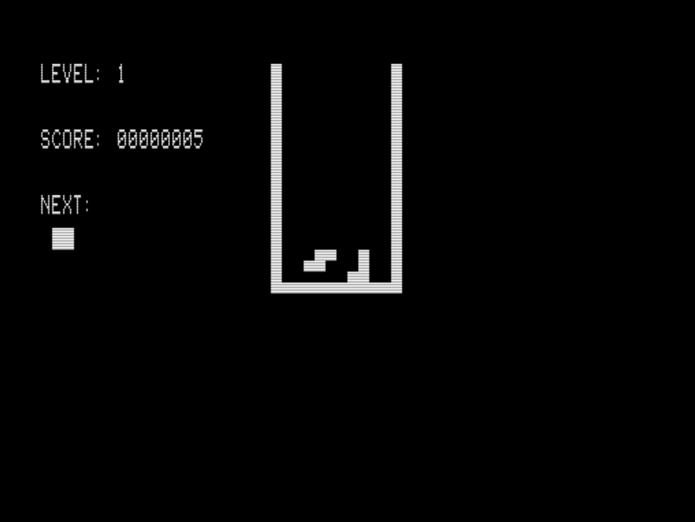

# Ttris for TRS-80 Model 1/3
*by Oscar Toledo G.*
*https://nanochess.org/*

This is my version of the popular tetraminoes game for TRS-80 computers model 1 and 3.

The TRS-80 computers are based on the Z80 processor and have directly mapped video RAM with predefined characters.

The source code is in _ttris.asm_ and it can be assembled using tniASM v0.44.

I've provided the utility _cmd.c_ to convert the generated binary to the CMD file executable in emulators and real hardware, along _e.bat_ to show how it is used.

The useful binary for these computers is _ttris.cmd_

You can see a video of the emulated [Ttris game on Youtube](https://youtu.be/kYh6txDJW7Q?si=XeSYipnMCuC4qLeM)

